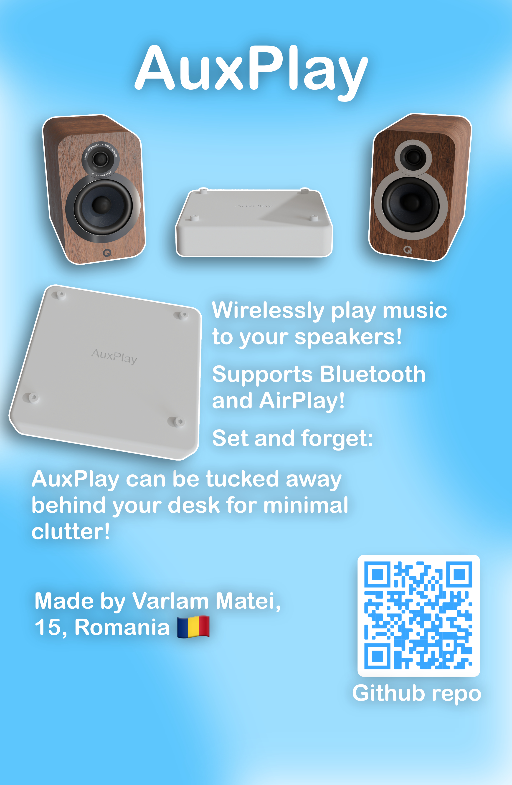
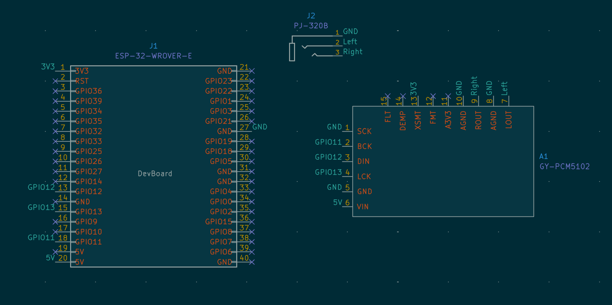
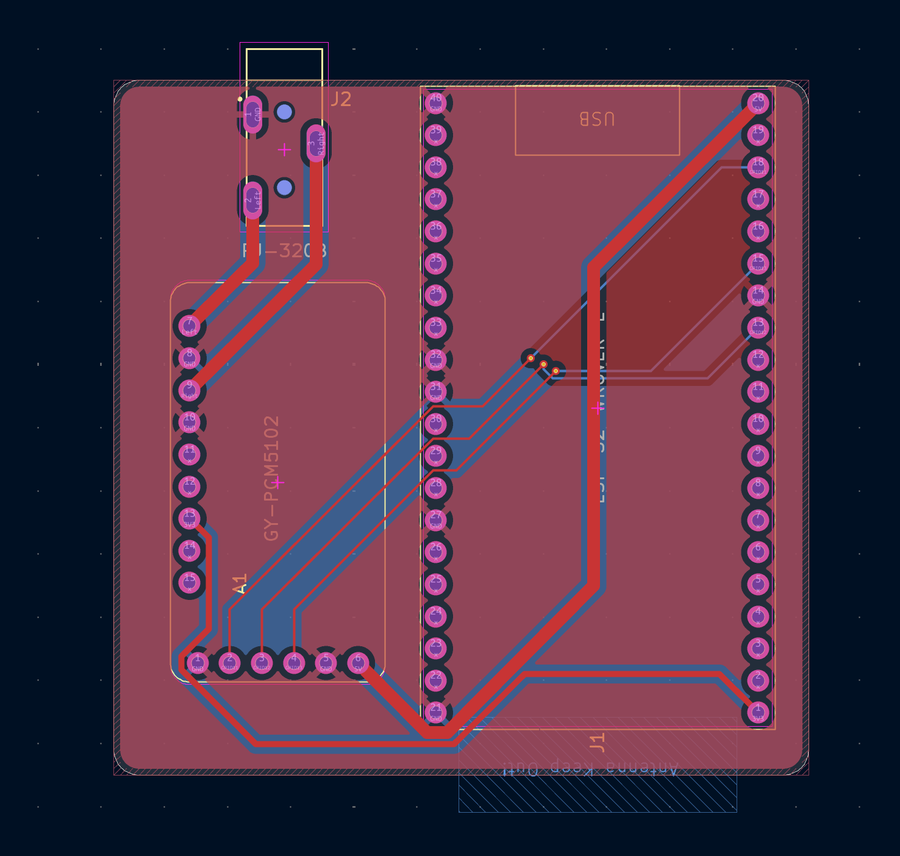
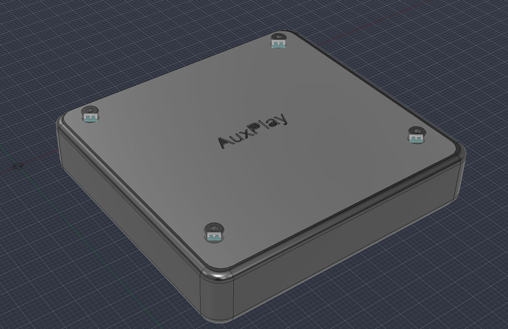
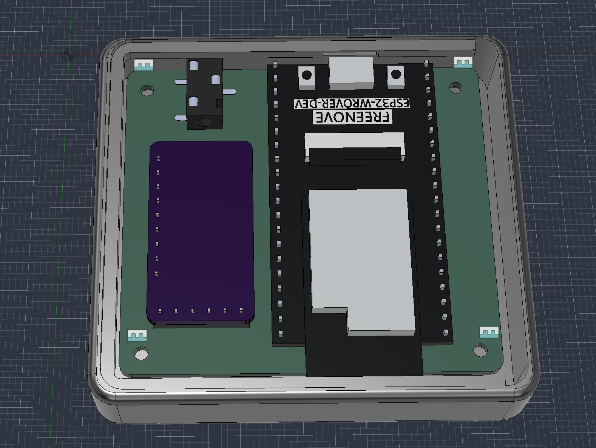

# AuxPlay
A esp32 based AirPlay receiver for powered speakers. 

Note: This DOES NOT include a amplifier, please connect this device to powered speakers or a speaker amplifier.

# Why?

I always wanted to play music wirelessly to my stereo. It was made in 2001 and it obviously does not have Bluetooth or AirPlay, so I decided to make a device that adds that functionality to it.

# Zine

# Schematic and PCB

For the "brains" I used a older esp32 module because the newer ones don't have classic bluetooth, required for Bluetooth A2DP, aka sound.

# Case

For the case I used Fusion 360. The top part of the case along with the motherbolt is screwed in with m2 screws. Preferably, the screws should be long (about 14mm) so it can reach the PCB along with the inserts at the bottom.

# Firmware

For the firmware, I am using [airplay-esp32 by rbouteiller](https://github.com/rbouteiller/airplay-esp32).

# BOM

|Product|Count|Cost|Link|
|--|--|--|--|
|Esp32|1|$17.99|[Freenove Store](https://store.freenove.com/products/fnk0060)
|I2S PCM5102A DAC|1|$2.62|[Aliexpress](https://www.aliexpress.com/item/1005012477247485.html?spm=a2g0o.productlist.main.2.493911331FnOXK&algo_pvid=4adcb7e1-8840-4df3-a0dd-f2ae6f0d7a4f&algo_exp_id=4adcb7e1-8840-4df3-a0dd-f2ae6f0d7a4f-1&pdp_ext_f=%7B%22order%22%3A%2223%22%2C%22eval%22%3A%221%22%2C%22fromPage%22%3A%22search%22%7D&pdp_npi=6%40dis%21USD%212.61%212.61%21%21%2117.68%2117.66%21%40211b61bb17835903966807937e499e%2112000058510522868%21sea%21RO%216479752192%21X%211%210%21n_tag%3A-29919%3Bd%3Ae8b90e1%3Bm03_new_user%3A-29895&curPageLogUid=5Cz8Hdx5unra&utparam-url=scene%3Asearch%7Cquery_from%3A%7Cx_object_id%3A1005012477247485%7C_p_origin_prod%3A)
|PJ-320B DIP Headphone Jack|1|$1.14|[Aliexpress](https://www.aliexpress.com/item/1005002436653862.html?spm=a2g0o.productlist.main.2.7c2f625aUkUTXv&algo_pvid=d1fdaacd-bc8b-40f6-9c8e-081c59262c6e&algo_exp_id=d1fdaacd-bc8b-40f6-9c8e-081c59262c6e-1&pdp_ext_f=%7B%22order%22%3A%2222%22%2C%22spu_best_type%22%3A%22price%22%2C%22eval%22%3A%221%22%2C%22fromPage%22%3A%22search%22%7D&pdp_npi=6%40dis%21USD%211.14%211.14%21%21%211.14%211.14%21%402103867617836015596551588e8313%2112000020655545215%21sea%21RO%216479752192%21X%211%210%21n_tag%3A-29919%3Bd%3Ae8b90e1%3Bm03_new_user%3A-29895&curPageLogUid=Cehayrqnawqp&utparam-url=scene%3Asearch%7Cquery_from%3A%7Cx_object_id%3A1005002436653862%7C_p_origin_prod%3A#nav-specification)
|Screws|1|$7.43|[Aliexpress](https://www.aliexpress.com/item/4000038065691.html?spm=a2g0o.productlist.main.2.4fadfc50T7ugPD&algo_pvid=18ba3291-ada3-4acc-b2ab-eb325b1662f7&algo_exp_id=18ba3291-ada3-4acc-b2ab-eb325b1662f7-1&pdp_ext_f=%7B%22order%22%3A%225087%22%2C%22eval%22%3A%221%22%2C%22fromPage%22%3A%22search%22%7D&pdp_npi=6%40dis%21USD%217.13%217.13%21%21%217.13%217.13%21%40210385db17836340050081368efa4c%2112000031580335588%21sea%21RO%216479752192%21X%211%210%21n_tag%3A-29919%3Bd%3Ae8b90e1%3Bm03_new_user%3A-29895&curPageLogUid=T9XwEPeDqjrQ&utparam-url=scene%3Asearch%7Cquery_from%3A%7Cx_object_id%3A4000038065691%7C_p_origin_prod%3A)
|PCB|1|$2|[JLCPCB](https://jlcpcb.com/)

# Credits

[Kicad](https://www.kicad.org/) - Schematic and PCB design

[Fusion 360](https://www.autodesk.com/products/fusion-360/overview) - Designing the case

[sstojos's zynthian miniature project](https://github.com/sstojos/zynthian-miniature) - For the footprint and symbol of the PCM5102A DAC module that I used

[airplay-esp32 by rbouteiller](https://github.com/rbouteiller/airplay-esp32) - Firmware

[Hackclub Fallout](https://fallout.hackclub.com)
